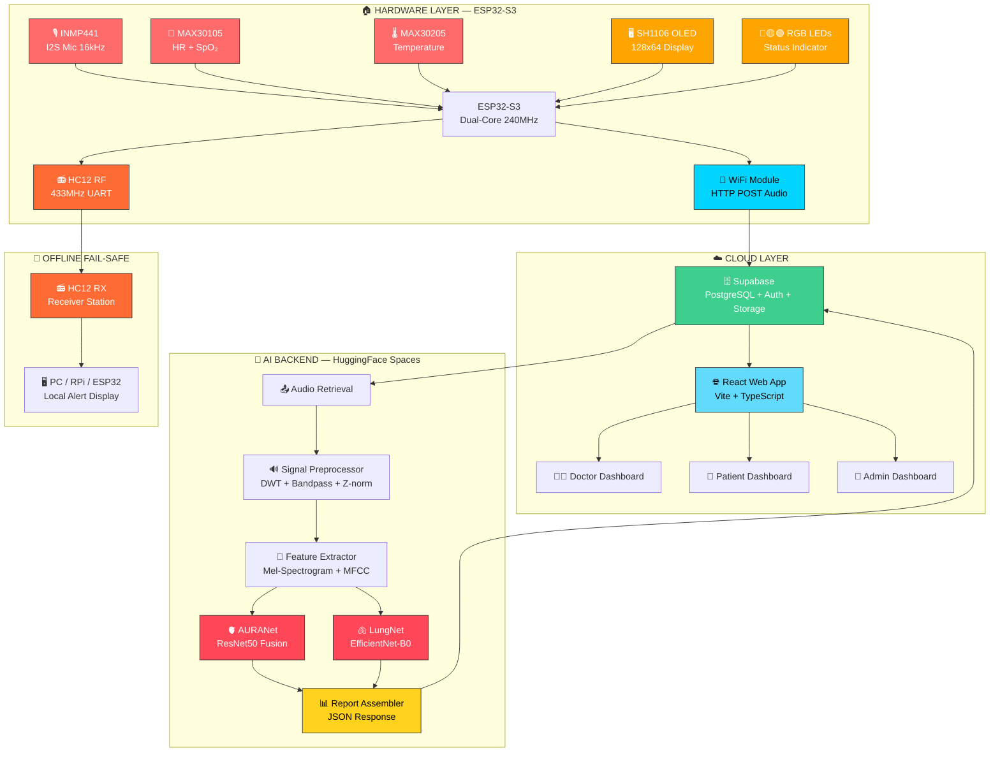

<div align="center">

<!-- Animated Header Banner -->


<!-- Badges Row 1 -->
<p>
  
  
  
  
</p>

<!-- Badges Row 2 -->
<p>
  
  
  
  
</p>

<!-- Badges Row 3 -->
<p>
  
  
  
  
</p>

<br/>

> **🏆 Built for Rural India — Bringing Cardiopulmonary AI Diagnostics Where Doctors Cannot Reach**

<br/>

<!-- Live Demo Button -->
<a href="https://live-vitals-web.lovable.app">
  
</a>
&nbsp;&nbsp;
<a href="https://github.com/cosmomanish007-pixel/live-vitals-web">
  
</a>
&nbsp;&nbsp;
<a href="mailto:manishdhatrak1121@gmail.com">
  
</a>

</div>

## 📋 Table of Contents

| # | Section |
|---|---------|
| 1 | [🔥 Problem Statement](#-problem-statement) |
| 2 | [💡 What is AURA-STETH AI?](#-what-is-aura-steth-ai) |
| 3 | [🏗️ Animated System Architecture](#️-animated-system-architecture) |
| 4 | [⚙️ Hardware Components](#️-hardware-components) |
| 5 | [🧠 AI Models & Metrics](#-ai-models--metrics) |
| 6 | [🗄️ Database Schema](#️-database-schema) |
| 7 | [🌐 Feature Showcase — Patient Flow](#-feature-showcase--patient-flow) |
| 8 | [👨‍⚕️ Feature Showcase — Doctor Dashboard](#-feature-showcase--doctor-dashboard) |
| 9 | [🔧 Feature Showcase — Admin Dashboard](#-feature-showcase--admin-dashboard) |
| 10 | [📡 Offline Fail-Safe (HC12 RF Module)](#-offline-fail-safe--hc12-rf-module) |
| 11 | [📊 Data Flow & AI Pipeline](#-data-flow--ai-pipeline) |
| 12 | [🚀 Getting Started](#-getting-started) |
| 13 | [📁 Repository Structure](#-repository-structure) |
| 14 | [🛣️ Roadmap](#️-roadmap) |
| 15 | [📈 Achievements](#-achievements) |
| 16 | [📬 Contact](#-contact) |

---

## 🔥 Problem Statement

<div align="center">

> *"India has **1 doctor per 1,511 people** — far below the WHO recommended ratio of 1:1,000. In rural areas, this gap widens dramatically. Cardiovascular and respiratory diseases are the **#1 and #3 leading causes of death** in India — yet early-stage auscultation diagnosis is nearly inaccessible outside urban hospitals."*

</div>

**The Core Challenges:**

| Challenge | Impact |
|-----------|--------|
| 🏥 Doctor shortage in rural PHCs | Patients travel 50–100 km for basic cardiac/lung screening |
| 🩺 Stethoscope skill barrier | Auscultation requires years of training — not scalable |
| 📡 Connectivity issues | Traditional telemedicine fails without stable internet |
| 💰 High cost of diagnostics | ECG, spirometry, CT scans cost thousands per visit |
| ⏱️ Delayed diagnosis | Murmurs and crackles go undetected until a critical stage |

<div align="center">
  
  
  <p><em>Rural India faces critical healthcare access gaps — AURA-STETH AI bridges this divide</em></p>
</div>

**AURA-STETH AI** solves this by putting a **ResNet50-powered AI cardiologist and EfficientNet-B0 pulmonologist** into a ₹2,000 ESP32 device that any health worker can operate with a guided 5-step workflow.

---

## 💡 What is AURA-STETH AI?

**AURA-STETH AI** is a complete end-to-end smart medical monitoring system — a custom-built ESP32 stethoscope that measures **heart rate, SpO₂, skin temperature, and auscultation audio**, streams it to a cloud dashboard with **AI-powered heart & lung diagnostics**, **real-time doctor consultation**, and **offline HC12 RF fail-safe transmission**.

```
🎙️ Record Audio  →  🧠 AI Analysis  →  📊 Clinical Report  →  👨‍⚕️ Doctor Review  →  💊 Digital Prescription
     10s WAV           < 30 sec          Risk Score + Labels      Live Video Call        PDF Download
```

<div align="center">
  <table>
    <tr>
      <td align="center"><b>📸 Front View</b></td>
      <td align="center"><b>📸 Side View</b></td>
      <td align="center"><b>📸 Internals</b></td>
    </tr>
    <tr>
      <td></td>
      <td></td>
      <td></td>
    </tr>
  </table>
  <p><em>Custom ESP32-S3 stethoscope — front, side with OLED display, and internal hardware</em></p>
</div>

### ✨ Feature Matrix

| Feature | Description | Status | Visual |
|---------|-------------|--------|--------|
| 🫀 **AI Heart Analysis** | Normal/Abnormal, murmurs, systole & diastole timing, valve risk | ✅ Live |  |
| 🫁 **AI Lung Analysis** | Normal / Crackle / Wheeze with confidence scores | ✅ Live |  |
| 🚨 **Artifact Detection** | Motion/tapping detection during recording, retry prompt | ✅ Live |  |
| 🌡️ **Skin Temperature** | MAX30205 I2C with exponential smoothing filter | ✅ Live |  |
| 💓 **Heart Rate + SpO₂** | MAX30105 optical PPG sensor | ✅ Live |  |
| 🎙️ **I2S Microphone** | INMP441 — 10s WAV capture at 16kHz | ✅ Live |  |
| 🖥️ **OLED Display** | SH1106 128×64 — real-time vitals + step instructions | ✅ Live |  |
| 🔴🟡🟢 **Traffic Light LEDs** | Visual on-device health status indicator | ✅ Live |  |
| 🩺 **Doctor Consultation** | Live video call + digital prescription generation | ✅ Live |  |
| 📄 **Clinical PDF Report** | Auto-generated with risk scoring per session | ✅ Live |  |
| 📡 **HC12 Offline Fail-Safe** | RF alert transmission with no WiFi needed | ✅ Live |  |

---

## 🏗️ Animated System Architecture

### Interactive Mermaid Diagram — Hover to Explore!



### 🌐 Live System Architecture (Click to Explore)

<div align="center">
  
  <p><em>Complete AURA-STETH AI System — Hardware Layer → Cloud Layer → AI Backend → Offline Fail-Safe</em></p>
</div>

### Technology Stack

| Layer | Technology | Logo |
|-------|------------|------|
| **MCU Firmware** | ESP32-S3, Arduino C++, FreeRTOS |  |
| **Frontend** | React 18, Vite, TypeScript, TailwindCSS |  |
| **Backend / DB** | Supabase (PostgreSQL + Auth + Storage) |  |
| **AI Host** | HuggingFace Spaces (Render) |  |
| **Heart Model** | ResNet50 + multi-scale fusion — AURANet |  |
| **Lung Model** | EfficientNet-B0 → 3-class softmax |  |
| **Offline RF** | HC12 433MHz RF module (TX/RX pair) |  |

---

## ⚙️ Hardware Components

### 🛠️ Component Overview

| # | Component | Role | Specs | Web Image |
|---|-----------|------|-------|-----------|
| 1 | **ESP32-S3** | Main MCU | Dual-core 240MHz, 8MB PSRAM |  |
| 2 | **INMP441** | I2S Mic | 16kHz, 10s WAV |  |
| 3 | **MAX30105** | PPG Sensor | HR + SpO₂ |  |
| 4 | **MAX30205** | Temp Sensor | ±0.1°C accuracy |  |
| 5 | **SH1106 OLED** | Display | 128×64px I2C |  |
| 6 | **HC12 RF** | Offline TX/RX | 433MHz, ~1km |  |

### 📸 Component Close-ups

<div align="center">
  <table>
    <tr>
      <td align="center"><br/>ESP32-S3 Board</td>
      <td align="center"><br/>INMP441 Mic</td>
      <td align="center"><br/>MAX30105 PPG</td>
    </tr>
    <tr>
      <td align="center"><br/>MAX30205 Temp</td>
      <td align="center"><br/>SH1106 OLED</td>
      <td align="center"><br/>HC12 RF Module</td>
    </tr>
  </table>
</div>

### 🔌 ESP32 Pin Map & Circuit Diagram

<div align="center">

| Sensor | Bus | Pins |
|--------|-----|------|
| 🎙️ INMP441 | I2S | GPIO 6 (WS), GPIO 7 (SCK), GPIO 8 (SD) |
| 💓 MAX30105 | I2C | GPIO 21 (SDA), GPIO 22 (SCL) |
| 🌡️ MAX30205 | I2C | Shared bus |
| 🖥️ SH1106 | I2C | Shared bus (addr 0x3C) |
| 📻 HC12 | UART | GPIO 17 (TX), GPIO 18 (RX) |
| 🔴 LED Red | GPIO | GPIO 2 |
| 🟡 LED Yellow | GPIO | GPIO 3 |
| 🟢 LED Green | GPIO | GPIO 4 |

  
  <p><em>ESP32-S3 Schematic — Complete wiring diagram for all sensors and modules</em></p>
</div>

---

## 🧠 AI Models & Metrics

### 🫀 AURANet — Heart Sound Classifier

> **Architecture:** ResNet50 backbone + multi-scale temporal fusion + clinical feature injection

<div align="center">
  <table>
    <tr>
      <td>
        <table>
          <tr><th>Metric</th><th>Value</th></tr>
          <tr><td><b>Best AUC (5-fold CV)</b></td><td><b>0.9578</b> 🏆</td></tr>
          <tr><td>Best Single Fold AUC</td><td>0.9367</td></tr>
          <tr><td>Global Decision Threshold</td><td>0.2807</td></tr>
          <tr><td>Optimal Decision Threshold</td><td>0.3416</td></tr>
          <tr><td>Sensitivity Target</td><td>0.85 (recall-optimised)</td></tr>
          <tr><td>Training Datasets</td><td>PhysioNet 2016 + CirCor 2022</td></tr>
        </table>
      </td>
      <td>
        
      </td>
    </tr>
  </table>
</div>

**Fold-wise AUC Breakdown:**

| Fold | Threshold | AUC | Performance |
|------|-----------|-----|-------------|
| Fold 1 | 0.2807 | 0.9367 | 🟢 Excellent |
| Fold 2 | 0.1739 | 0.8739 | 🟡 Good |
| Fold 3 | 0.6916 | **0.9578** | 🟢 ⭐ Best |
| Fold 4 | 0.2773 | 0.9273 | 🟢 Excellent |
| Fold 5 | 0.3804 | 0.9380 | 🟢 Excellent |

**Outputs per Inference:**

```
heart_label    → Normal / Abnormal
abnormal_prob  → 0.0 – 1.0  (probability score)
ai_bpm         → AI-derived heart rate (beats/min)
systole_ms     → Systolic phase duration (ms)
diastole_ms    → Diastolic phase duration (ms)
sqi            → Signal Quality Index (0–100)
valve_risk     → None / Low / Medium / High
sys_murmur     → YES / NO
dia_murmur     → YES / NO
```

---

### 🫁 LungNet — Respiratory Sound Classifier

> **Architecture:** EfficientNet-B0 on Mel-Spectrogram → 3-class softmax

<div align="center">
  <table>
    <tr>
      <td>
        <table>
          <tr><th>Metric</th><th>Value</th></tr>
          <tr><td><b>ICBHI 2017 Score</b></td><td><b>70.47%</b> 🏆</td></tr>
          <tr><td>Best AUC (multiclass OvR)</td><td><b>0.8495</b></td></tr>
          <tr><td>Overall AUC</td><td>0.8078</td></tr>
          <tr><td>Input Sample Rate</td><td>22,050 Hz</td></tr>
          <tr><td>Breathing Cycle Window</td><td>5 seconds</td></tr>
          <tr><td>Training Datasets</td><td>ICBHI 2017 + SPRSound 2022</td></tr>
        </table>
      </td>
      <td>
        
      </td>
    </tr>
  </table>
</div>

**Output Classes:**

| Class | Description | Indication |
|-------|-------------|------------|
| 🟢 **Normal** | Clear breath sounds | No pathology detected |
| 🟡 **Crackle** | Discontinuous adventitious sounds | Pneumonia, fibrosis, fluid |
| 🔴 **Wheeze** | Continuous high-pitched sounds | Asthma, COPD, bronchospasm |

**Example Full AI Inference Output:**

```json
{
  "heart": {
    "label": "Normal",
    "abnormal_prob": 0.071,
    "ai_bpm": 44.4,
    "systole_ms": 272,
    "diastole_ms": 335,
    "sqi": 91,
    "valve_risk": "None",
    "sys_murmur": false,
    "dia_murmur": false
  },
  "lung": {
    "label": "Crackle",
    "normal_pct": 22.7,
    "crackle_pct": 58.2,
    "wheeze_pct": 19.1,
    "confidence": 0.582
  },
  "artifact": false,
  "alert": "AI Alert: Abnormality Detected"
}
```

---

## 🗄️ Database Schema (Supabase PostgreSQL)

```mermaid
erDiagram
    sessions ||--o{ vitals : "has"
    sessions ||--o{ statuses : "tracks"
    sessions ||--o{ consultation_requests : "generates"
    profiles ||--o{ consultation_requests : "assigned_to"
    consultation_requests ||--o{ consultation_medicines : "prescribes"

    sessions {
        uuid id PK
        text state
        text mode
        text user_name
        int age
        text gender
        uuid user_id FK
        timestamp created_at
        bool consultation_completed
    }

    vitals {
        uuid id PK
        uuid session_id FK
        float temp
        int hr
        int spo2
        text audio
        text ai_heart_label
        float ai_heart_prob
        text ai_lung_label
        float ai_lung_conf
        int ai_sqi
        float ai_bpm
        int ai_systole_ms
        int ai_diastole_ms
        text ai_valve_risk
        float ai_normal_pct
        float ai_crackle_pct
        float ai_wheeze_pct
        text ai_alert
        bool ai_artifact
    }

    profiles {
        uuid id PK_FK
        text role
        text doctor_status
        text license_number
        text specialization
        text hospital
        bool is_available
        text full_name
    }

    consultation_requests {
        uuid id PK
        uuid session_id FK
        uuid doctor_id FK
        text risk_level
        text status
        text doctor_notes
        text diagnosis
        text advice
        text follow_up_date
        text video_channel
    }

    consultation_medicines {
        uuid id PK
        uuid consultation_id FK
        text medicine_name
        text dosage
        text frequency
        text duration
        int total_quantity
    }
```

---

## 🌐 Feature Showcase — Patient Flow

### 📱 1. Splash Screen & Authentication

<div align="center">
  <table>
    <tr>
      <td align="center"><b>✨ Splash Screen</b></td>
      <td align="center"><b>👤 Patient Login</b></td>
      <td align="center"><b>📝 Registration</b></td>
    </tr>
    <tr>
      <td></td>
      <td></td>
      <td></td>
    </tr>
  </table>
</div>

### 📋 2. Patient Dashboard & Session Initiation

<div align="center">
  <table>
    <tr>
      <td align="center"><b>🏠 Dashboard</b></td>
      <td align="center"><b>👤 Patient Details</b></td>
    </tr>
    <tr>
      <td></td>
      <td></td>
    </tr>
  </table>
</div>

### 🔬 3. Guided 5-Step Monitoring Process

<div align="center">

| Step 1 | Step 2 | Step 3 | Step 4 | Step 5 |
|--------|--------|--------|--------|--------|
|  |  |  |  |  |
| **System Init** | **Temperature** | **Auscultation** | **HR & SpO₂** | **AI Analysis** |

</div>

> **🔴→🟡→🟢** Step 1: Init → Step 2: Temp (MAX30205) → Step 3: Record 10s (INMP441) → Step 4: HR/SpO₂ (MAX30105) → Step 5: AI Final

### 📊 4. Clinical Report — AI Results

<div align="center">
  <table>
    <tr>
      <td align="center"><b>🟢 Normal Report</b></td>
      <td align="center"><b>🔴 Abnormal Alert</b></td>
      <td align="center"><b>⚠️ Artifact Warning</b></td>
    </tr>
    <tr>
      <td></td>
      <td></td>
      <td></td>
    </tr>
  </table>
</div>

<div align="center">
  <table>
    <tr>
      <td align="center"><b>🟢 Green LED — Normal</b></td>
      <td align="center"><b>🔴 Red LED — Alert</b></td>
    </tr>
    <tr>
      <td></td>
      <td><img src="images/img_47.jpg" width="300
